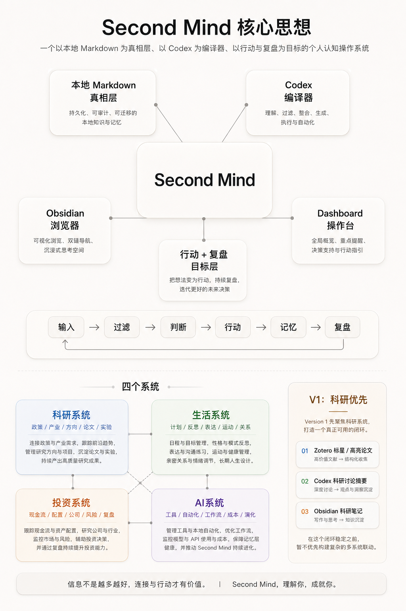

# Second Mind

Second Mind is a local-first personal cognitive operating system.



It is not just a note system, not just a chat interface, and not just a knowledge base.  
Its purpose is to help the user continuously turn complex inputs into judgment, action, memory, and review.

## Core Definition

Second Mind = a personal cognitive operating system with:

- local Markdown as the source of truth
- Codex as the compiler
- Obsidian as the browser
- a dashboard as the control console
- action and review as the end goal

## Core Loop

```text
information intake -> AI filtering -> judgment -> action -> memory -> review -> better future decisions
```

## Four Systems

Second Mind is organized into four connected systems:

- Research System
- Life System
- Investment System
- AI System

These systems are not isolated folders. They are coordinated parts of one personal operating system.

## Why It Exists

Most personal knowledge systems stop at storage or retrieval.  
Second Mind is designed to go further:

- filter information instead of hoarding it
- connect thinking across domains
- support decisions, not only summaries
- turn knowledge into next-step action
- keep memory readable, portable, and local-first

## V1 Priority: Research First

Version 1 focuses on the Research System first.

The initial goal is to make one loop truly work:

```text
input -> scoring -> compilation -> memory -> action -> review
```

Before that loop is stable, Second Mind v1 will not prioritize:

- automatic mentor scheduling
- graph visualization
- multi-system auto-linked dashboards

## Initial Input Sources

Research v1 only ingests:

- starred and highlighted papers from Zotero
- Codex research discussion summaries
- Obsidian research notes

## Repository Scope

This repository currently focuses on documentation and architecture, not full production code.

It contains:

- product overview
- operating principles
- research-first strategy
- wiki schema v1
- Research Loop 中文原型 PRD
- 用于验证 v1 闭环的静态中文产品原型

## Prototype

当前静态原型已经扩展为中文优先的 **四系统控制台**，用于验证 Research、AI、Life、Investment 如何在同一界面中协同运行。

其中研究系统仍然优先验证这条核心闭环：

```text
输入 -> 判断 -> 记忆 -> 行动 -> 复盘
```

在浏览器中打开 `prototype/index.html` 即可查看交互式静态原型。

相关 PRD 位于 `docs/PRD_RESEARCH_LOOP_PROTOTYPE.md`。

本地工具接入建议见 `docs/OBSIDIAN_ZOTERO_SETUP.md`。

Obsidian 四系统起步骨架见 `obsidian-vault-starter/`。

## Guiding Principles

Second Mind is shaped by two enduring design principles:

- Apple-like product clarity and subtraction
- first-principles engineering

These principles are documented in `docs/PERSONAL_OPERATING_PRINCIPLES.md`.

## Status

This repository is the public documentation layer of Second Mind.  
The implementation will evolve in stages, starting from the Research System.
